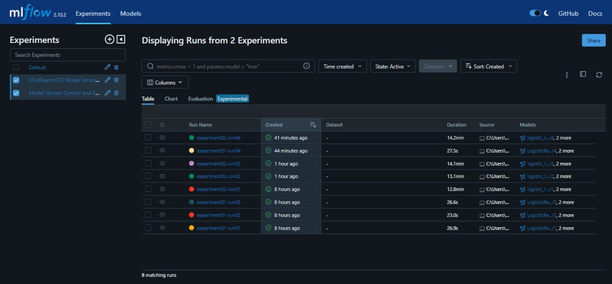
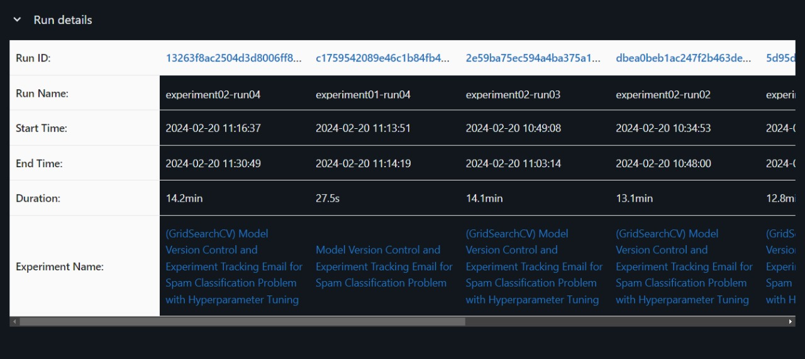
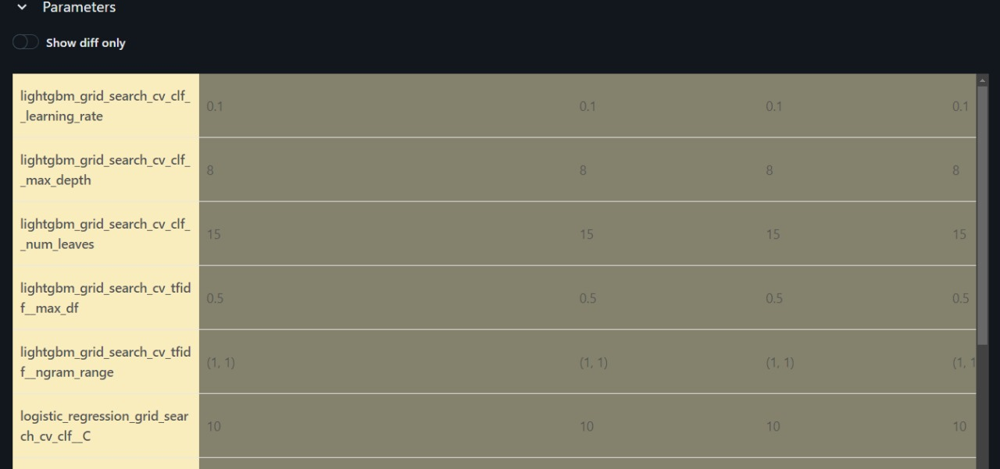
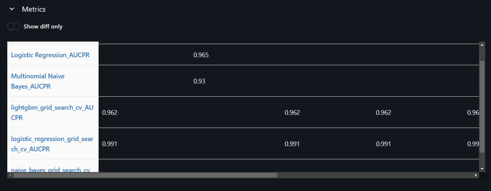
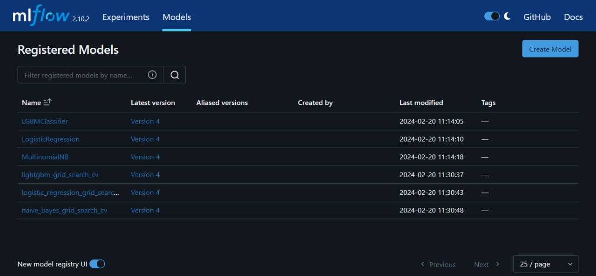
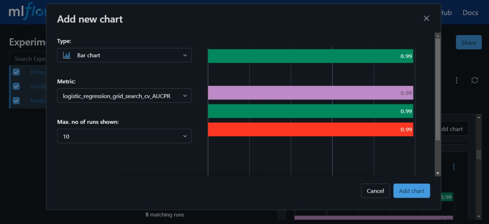
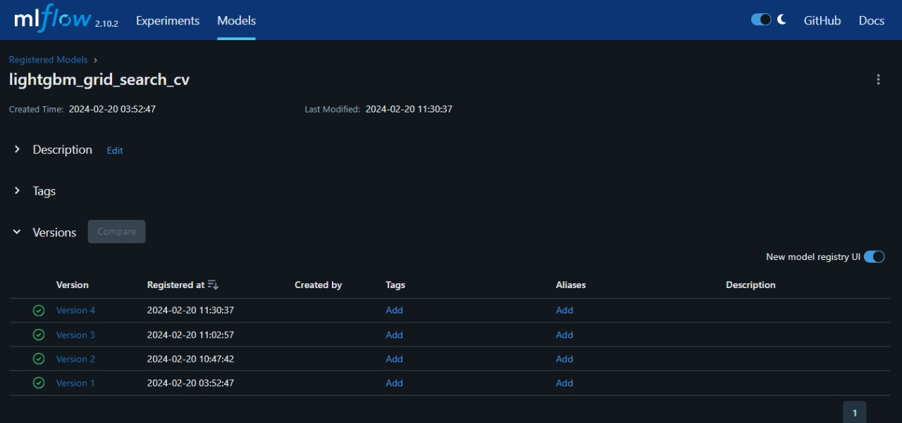

# Experimental Tracking for Spam Classification

This repository contains code and resources for experimental tracking and model version control for a spam classification problem. It includes scripts for data version control using DVC and model training, hyperparameter tuning using GridSearchCV tracking using MLflow.

## Project Structure

The repository contains the following files and directories:

* `data/raw`: Contains the raw data file `raw_data.csv`.
* `data/prepared`: Contains the preprocessed and split data files (train, validation, test).
* `src`:
    * `mlruns`: Stores MLflow experiment runs.
    * `train.ipynb`: Jupyter notebook for data preprocessing, splitting, and saving.
    * `prepare.ipynb`: Jupyter notebook for data version control using `dvc`.
* `.dvc`: DVC configuration file.
* `.dvcignore`: Files ignored by DVC.
* `README.md`: This README file providing an overview of the repository.
* `images`: Contains images used in the README.md.

## MLflow UI Screenshots

Below are screenshots from the MLflow UI:

### Homepage Overview

*This screenshot provides an overview of the MLflow UI homepage, displaying a list of all experiments conducted.*

### Run Details

*This screenshot presents detailed information about each run, including 'Run Id', 'Run Name', 'Start Time', 'End Time', 'Duration', and 'Experiment Name'.*

### Parameters Details

*This screenshot showcases the parameter details of various models, providing insights into the configurations used during experimentation.*

### Performance Metrics

*This screenshot illustrates the performance metric, i.e. AUCPR, of all models across multiple runs, aiding in the comparison of model performance.*

### Registered Models

*This screenshot displays a list of registered models along with their latest versions.*

### AUCPR of Logistic Regression

*This screenshot exhibits a bar graph depicting the consistent AUCPR scores of the Logistic Regression model with hyperparameter tuning across different runs.*

### List of model versions lightgbm

*This screenshot presents the list of versions of the lightgbm model along with their registration status, providing an overview of model evolution over time.*

## Running the Notebooks

1. Install the required libraries: `pip install dvc mlflow sklearn pandas matplotlib seaborn lightgbm`.
2. Set up DVC remote storage: follow the instructions in `prepare.ipynb`.
3. Run `prepare.ipynb` to track the raw data with DVC.
4. Run `train.ipynb` to:
    * Preprocess the text data.
    * Split the data into train, validation, and test sets.
    * Track data versions with DVC.
    * Build, track, and register benchmark models with MLflow:
        * Logistic regression
        * Multinomial naive Bayes
        * LightGBM
    * Use GridSearchCV to tune hyperparameters for the models.
    * Print the "AUCPR" metric on the test dataset for the best model.

## Experiment Tracking

- **DVC**: Data version control is implemented using DVC, allowing for tracking changes in data and maintaining reproducibility.
- **MLflow**: Model experiments, parameters, metrics, and versions are tracked using MLflow, providing insights into model performance and facilitating model management.

## Requirements

Ensure you have the following dependencies installed:
- Python 3.x
- Jupyter Notebook
- DVC
- MLflow
- LightGBM
- Scikit-learn
- Pandas
- Matplotlib
- Seaborn
- NLTK

